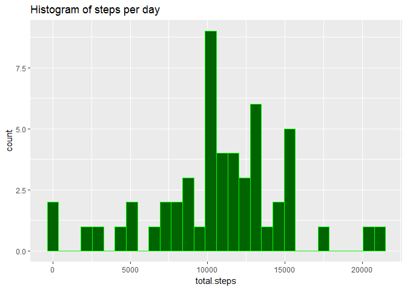
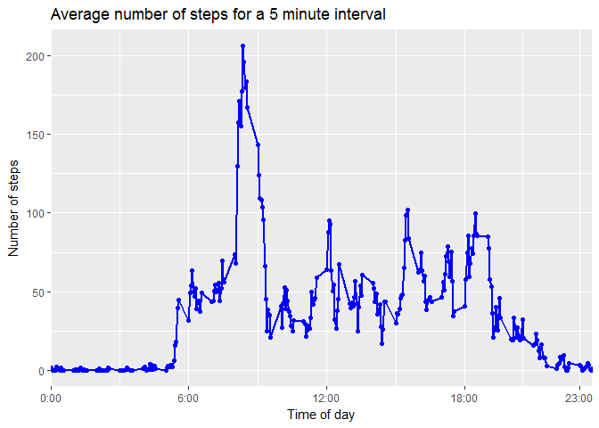
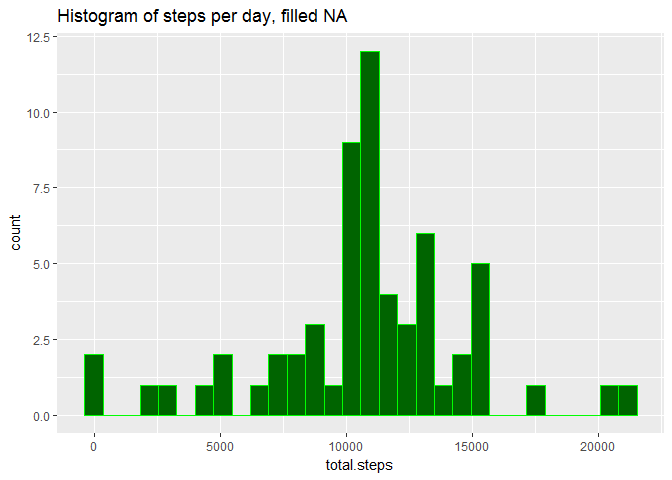
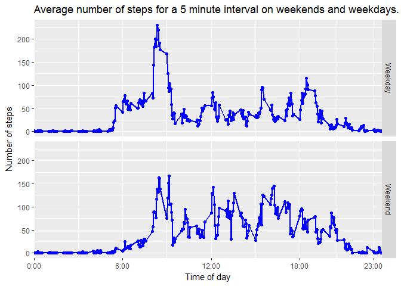

# Reproducible Research: Peer Assessment 1

## Loading packages

```r
library(dplyr)
library(ggplot2)
```

## Loading and preprocessing the data

```r
activity <- read.csv("activity/activity.csv")
```
## What is mean total number of steps taken per day?


```r
activity_by_date <- activity %>%
  group_by(date) %>%
  summarize(total.steps = sum(steps)) 


day_mean <- mean(activity_by_date$total.steps, na.rm=TRUE)
day_median <- median(activity_by_date$total.steps, na.rm=TRUE)
```
The **average number** of steps per day was 10766.19, and the **median** was 10765.


```r
p <- ggplot(activity_by_date,aes(total.steps))
p + geom_histogram(fill="darkgreen", colour="green") + labs(title="Histogram of steps per day")
```

```
## `stat_bin()` using `bins = 30`. Pick better value with `binwidth`.
```

```
## Warning: Removed 8 rows containing non-finite values (stat_bin).
```

<!-- -->

## What is the average daily activity pattern?

```r
average_day <- activity %>%
  group_by(interval) %>%
  summarize(average.steps=mean(steps, na.rm=TRUE))
most_active <- which.max(average_day$average.steps)
most_active_string <- sprintf("%04d",unlist(average_day[most_active, "interval"]))
most_active_string <- paste(substr(most_active_string,1,2), substr(most_active_string,3,4), sep=":")
max_steps <- average_day$average.steps[most_active]
```

```r
p <- ggplot(data=average_day, aes(interval, average.steps))
p + geom_point(colour="blue") + geom_line(colour="blue", size=1) +scale_x_continuous(limits=c(0,2355), expand=c(0,0), labels=c("0:00", "6:00", "12:00",  "18:00", "23:00"), breaks=c(0, 600, 1200, 1800, 2300)) +
  labs(title="Average number of steps for a 5 minute interval", x="Time of day", y="Number of steps")
```

<!-- -->
  
The most active 5 minute time interval is at 08:35, with the average numbver of 206.2 steps.


## Imputing missing values

```r
activity.na.rm <- activity
index_missing <- which(is.na(activity.na.rm$steps))
for(i in index_missing){
  activity.na.rm[i, "steps"] <- average_day[average_day$interval==activity.na.rm[i,"interval"],"average.steps"]
}
```


```r
activity.na.rm_by_date <- activity.na.rm %>%
  group_by(date) %>%
  summarize(total.steps = sum(steps)) 


day_mean.na.rm <- mean(activity.na.rm_by_date$total.steps, na.rm=TRUE)
day_median.na.rm <- median(activity.na.rm_by_date$total.steps, na.rm=TRUE)
```
The **average number** of steps per day was 10766.19, and the **median** was 10766.19. The average does not change, which makes sense as we input the average for all NA. Since the only records missing were records for entire days, this operation does not change the daily average. The median does change - it is now equal to the mean, which again makes sense as we added quite a few "average" days into our data and the median is likely to be equal to one of them. 


```r
p <- ggplot(activity.na.rm_by_date,aes(total.steps))
p + geom_histogram(fill="darkgreen", colour="green") + labs(title="Histogram of steps per day, filled NA")
```

```
## `stat_bin()` using `bins = 30`. Pick better value with `binwidth`.
```

<!-- -->
    
## Are there differences in activity patterns between weekdays and weekends?


```r
activity.na.rm_by_weekend <- activity.na.rm %>% 
  mutate(day=weekdays(as.Date(date), abbreviate=TRUE)) %>%
  group_by(interval, is.weekend=ifelse(is.element(day,c("Sat", "Sun")), "Weekend", "Weekday")) %>% 
  summarize(average.steps = mean(steps))
```


```r
p <- ggplot(data=activity.na.rm_by_weekend, aes(interval, average.steps))
p + geom_point(colour="blue") + facet_grid(is.weekend~.) + geom_line(colour="blue", size=1) + scale_x_continuous(limits=c(0,2355), expand=c(0,0), labels=c("0:00", "6:00", "12:00",  "18:00", "23:00"), breaks=c(0, 600, 1200, 1800, 2300)) +
  labs(title="Average number of steps for a 5 minute interval on weekends and weekdays.", x="Time of day", y="Number of steps") 
```

<!-- -->

